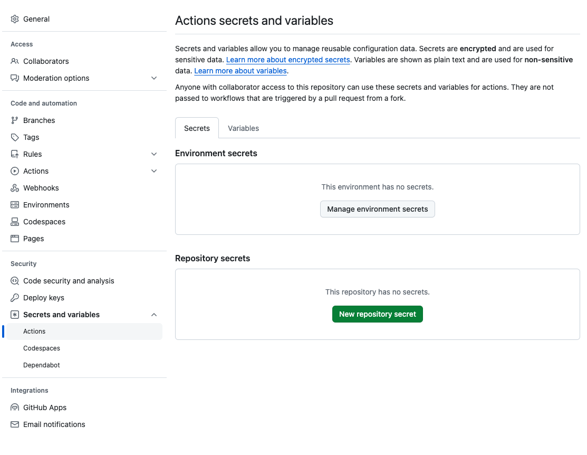
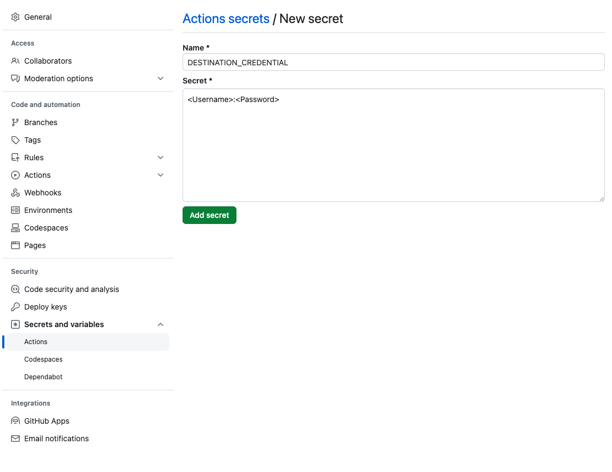
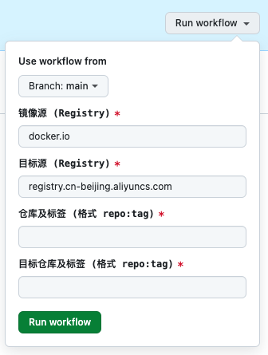
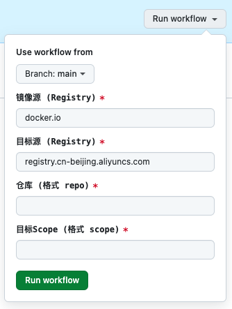

## 同步DockerHub上的镜像仓库到阿里云容器镜像仓库

Docker 的一些服务所在域名被封杀，无法直接访问和拉取镜像。国内的镜像源又宣布停止服务，所以需要一个工具将DockerHub上的镜像同步到阿里云容器镜像仓库。

阿里云容器镜像仓库提供了个人实例服务，支持最多创建300个仓库，而且免费。个人使用完全够满足需求。

阿里云容器镜像仓库地址： [https://cr.console.aliyun.com/](https://cr.console.aliyun.com/)

## Copy.yml 运行介绍

这个工具主要是将 DockerHub 上某个仓库下的某个标签同步到阿里云容器镜像仓库。

1. 使用阿里云开通个人实例服务，并获取 [登录用户名和固定密码](https://cr.console.aliyun.com/cn-hangzhou/instance/credentials)

2. 克隆本仓库，在仓库设置中配置阿里云密码，注意 *Name* 必须为 `DESTINATION_CREDENTIAL` 且内容格式必须为 `<Username>:<Password>` 即用户名和密码之间用冒号分隔。





3. 在 *Actions* 页面上选择 *copy.yml* 点击 *Run workflow* 填写内容即可运行。



> 填写说明：
>
> 如同步 DockerHub 上的 nginx:1.13 到 阿里云容器镜像仓库 registry.cn-beijing.aliyuncs.com/ikrong/nginx:1.13，则填写如下：
>
> ```yaml
> # 镜像源 (Registry)
> source: docker.io
> # 目标源 (Registry)
> destination: registry.cn-beijing.aliyuncs.com
> # 仓库及标签 (格式 repo:tag)
> source_repo: nginx:1.13
> # 目标仓库及标签 (格式 repo:tag)
> destination_repo: ikrong/nginx:1.13
> ```
> 必须要填写仓库及标签

## Sync.yml 运行介绍

这个工具主要是将 DockerHub 上某个仓库下的所有标签全部同步到阿里云容器镜像仓库。

1. 配置密码同上

2. 在 *Actions* 页面上选择 *sync.yml* 点击 *Run workflow* 填写内容即可运行。



> 填写说明：
>
> 如同步 DockerHub 上的 nginx 的所有标签到阿里云容器镜像仓库 registry.cn-beijing.aliyuncs.com/ikrong/nginx，则填写如下：
>
> ```yaml
> # 镜像源 (Registry)
> source: docker.io
> # 目标源 (Registry)
> destination: registry.cn-beijing.aliyuncs.com
> # 仓库 (格式 repo)
> source_repo: nginx
> # 目标Scope (格式 scope)
> destination_scope: ikrong
> ```
> 只需要填写需要同步的仓库和目标仓库所在的scope

## 镜像同步之后如何使用

当使用上面办法将镜像同步到阿里云容器镜像仓库后，就可以直接使用阿里云容器镜像仓库的镜像了。

以 `nginx:1.13` 为例:

1. 使用命令拉取 

```sh
docker pull registry.cn-beijing.aliyuncs.com/ikrong/nginx:1.13
```

2. 在 `Dockerfile` 中使用：

```dockerfile
FROM registry.cn-beijing.aliyuncs.com/ikrong/nginx:1.13

# 其他内容
```
